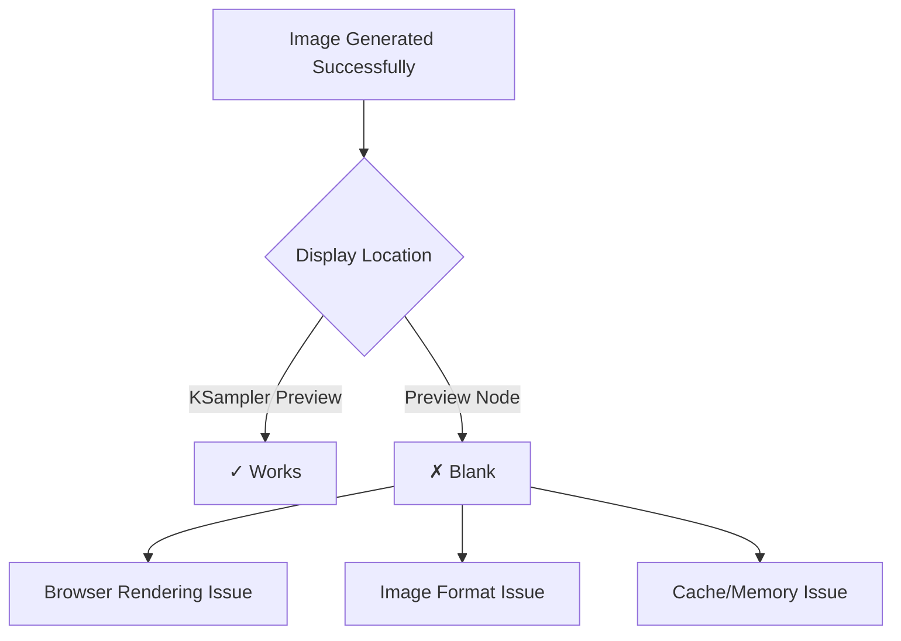

# Enhanced GitHub Response for Issue #8403

**Issue**: Preview node is Blank  
**Author**: Explyy  
**Classification**: needs_information/missing_error_logs (confidence: 0.85)  
**Created**: 2025-06-03T09:26:34Z  

## Quick Summary
Thank you for the screenshot and confirming you've tested without custom nodes! To help diagnose why your Preview node shows blank while KSampler preview works, we need some additional diagnostic information.

## Information Required for Diagnosis

### Browser Console Logs
Could you please check your browser's developer console for any error messages?

**How to access:**
- **Chrome/Edge**: Press F12 → Console tab
- **Firefox**: Press F12 → Console tab  
- **Safari**: Develop menu → Show Web Inspector → Console

Look for any red error messages when you try to generate/view the preview.

### ComfyUI Console Output
Please check the ComfyUI terminal/console window for any error messages that appear when:
1. You queue the generation
2. The preview should appear but stays blank

### System Information
- **Operating System**: (Windows/macOS/Linux + version)
- **Browser**: (Chrome, Firefox, Safari + version)
- **ComfyUI Version**: (Help → About or check git commit)
- **GPU**: (NVIDIA/AMD model + VRAM amount)

### Workflow Details
Could you share:
- The workflow file (.json) or a minimal workflow that reproduces this issue
- Image format and size you're generating
- Any specific nodes connected to the Preview node

## Common Causes & Quick Fixes

### Browser Display Issues
Since KSampler preview works but Preview node doesn't, this is likely a frontend rendering issue:



**Immediate fixes to try:**
1. **Hard refresh browser**: Ctrl+F5 (Windows) or Cmd+Shift+R (Mac)
2. **Clear browser cache**: Browser settings → Clear browsing data
3. **Test in incognito/private mode**: Rules out extensions/cache issues
4. **Try different browser**: Chrome, Firefox, or Edge

### Image Display Problems
- **Large image size**: Very large images may fail to render in Preview nodes
- **Unusual aspect ratios**: Some extreme ratios can cause display issues
- **Memory constraints**: Browser may run out of memory for large previews

## Troubleshooting Steps

1. **Test with simple workflow**:
   ```
   LoadImage → Preview
   ```
   Does a basic loaded image show in Preview node?

2. **Check image properties**:
   - What resolution are you generating?
   - Does the issue happen with smaller images (e.g., 512x512)?

3. **Browser debugging**:
   - Right-click on blank Preview node → Inspect Element
   - Look for any missing image sources or broken elements

## Related Resources

- **General Troubleshooting**: https://docs.comfy.org/troubleshooting/overview
- **Browser Compatibility**: https://docs.comfy.org/installation/system_requirements
- **Similar Issue**: #2323 (resolved with browser cache clearing)

## Next Steps

Once you provide the console logs and system information, we can pinpoint the exact cause. Preview node display issues are usually related to:
- Browser cache/rendering problems (most common)
- Large image memory limits
- Frontend JavaScript errors
- Image format handling differences

The fact that KSampler preview works confirms your workflow and image generation are working correctly - this is specifically a Preview node display issue.

---

**Additional Help:**
- ComfyUI Discord: https://discord.gg/comfyui
- r/comfyui community: https://reddit.com/r/comfyui
- GitHub Discussions: https://github.com/comfyanonymous/ComfyUI/discussions